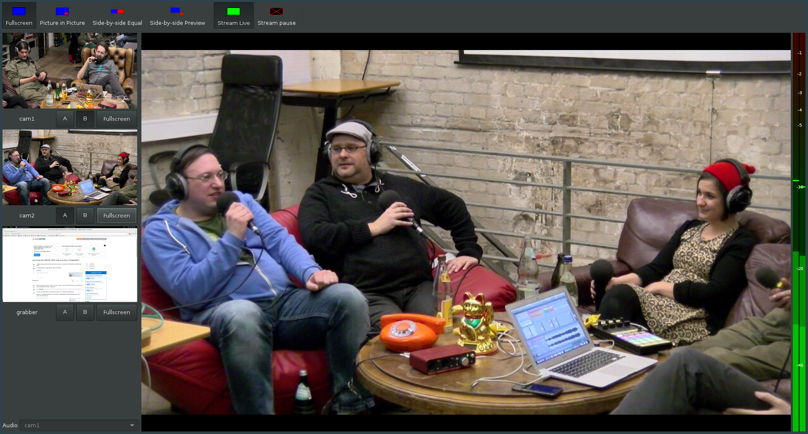

# Voctogui - The GUI frontend for Voctocore



## Usage
### Keyboard Shortcuts
#### Composition Modes
- `F1` Fullscreen
- `F2` Picture in Picture
- `F3` Side-by-Side Equal
- `F4` Side-by-Side Preview

#### Select A-Source
- `1` Source Nr. 1
- `2` Source Nr. 2
- …

#### Select B-Source
- `Ctrl+1` Source Nr. 1
- `Ctrl+2` Source Nr. 2
- …

#### Set Fullscteen
- `Alt+1` Source Nr. 1
- `Alt+2` Source Nr. 2
- …

#### Stream Blanking
- F11 Set stream to Pause-Loop
- F12 Set stream Live

#### Other options
- `t` Cut

### Select an Audio-Source
Click twice on the selection combobox, then select your source within 5 Seconds. (It will auto-lock again after 5 seconds.)

## Configuration
On startup the GUI reads the following configuration files:
 - `<install-dir>/default-config.ini`
 - `<install-dir>/config.ini`
 - `/etc/voctomix/voctogui.ini`
 - `/etc/voctogui.ini`
 - `<homedir>/.voctogui.ini`
 - `<File specified on Command-Line via --ini-file>`

From top to bottom the individual settings override previous settings. `default-config.ini` should not be edited, because a missing setting will result in a Python exception.

On startup the GUI fetches all configuration settings from the core and merges them into the GUI config.

### Configuration Options

All options are distributed into sections like usual in INI files. The following list describes all sections with all options available in voctogui.

#### server
```
[server]
host=localhost
```

##### host=*\<addr\>*
Set up host address of voctocore instance.
`server.host` is **obligatory** and must contain a valid IP or domain name.

#### previews
```
[previews]
width=320
height=180
use=true
```

##### width=*\<pixels\>*
Width of the video preview widgets in pixels.
`previews.width` is **optional** and will be set to `320` by default.

##### height=*\<pixels\>*
Height of the video preview widgets in pixels.
`previews.height` is **optional** and will be related to `previews.width` by using a 16:9 ratio by default.

##### use=*\<boolean\>*
If set to `true` try to use encoded previews as long as the host is providing this (see `previes.enabled` in host configuration, which has to be activated).
If set to `false` host will not even be asked to encode the preview videos and instead raw-video will be used between host and gui.  

**Attention:** Connecting to a remote host might not work without enabeling the preview encoders because it might saturate your ethernet link between the two machines. On the other hand when host is on `localhost` using raw-video will usually reduce CPU usage.

#### mainvideo
```
[mainvideo]
playaudio=false
```

##### playaudio=*\<boolean\>*
If set to `true` plays audio in the voctomix GUI.

**Attention:** Currently disabled by default because of https://github.com/voc/voctomix/issues/37.

#### videodisplay
```
[videodisplay]
system=gl
```

##### system=*\<type\>*
Sets the technology to use to display video on screen. Can be set to the following values:

- `gl` = Use OpenGL (most performant)
- `xw` = Use XVideo (old school)
- `x` = Use X-Images (least performance)

`videodisplay.system` is **obligatory** and must contain one of the listed values.

#### misc
```
[misc]
close=true
cut=true
```

##### close=*\<boolean\>*
Will show the close button if set to `true`

##### cut=*\<boolean\>*
Will show the cut button if set to `true`

#### audio
```
[audio]
forcevolumecontrol=true
```
If set to `true` shows volume controls even if a default audio source is set.
